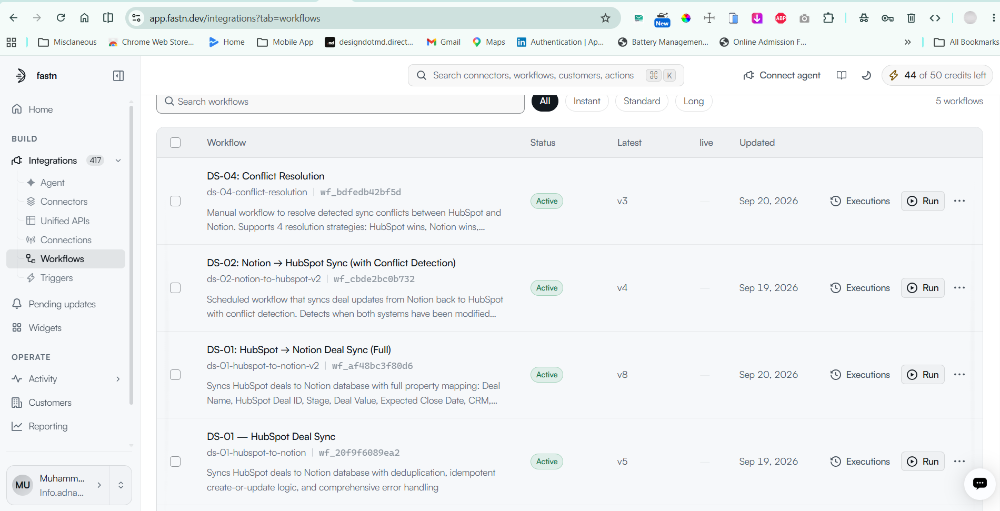
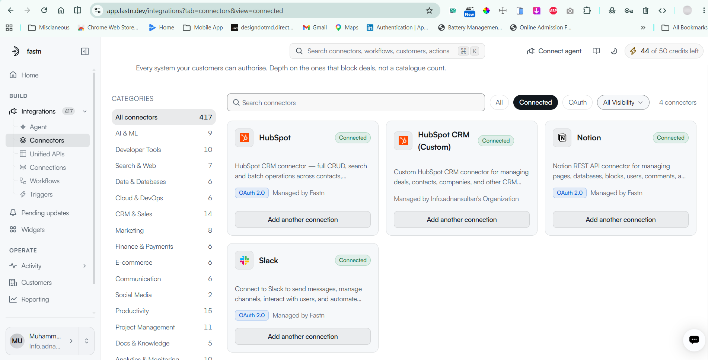
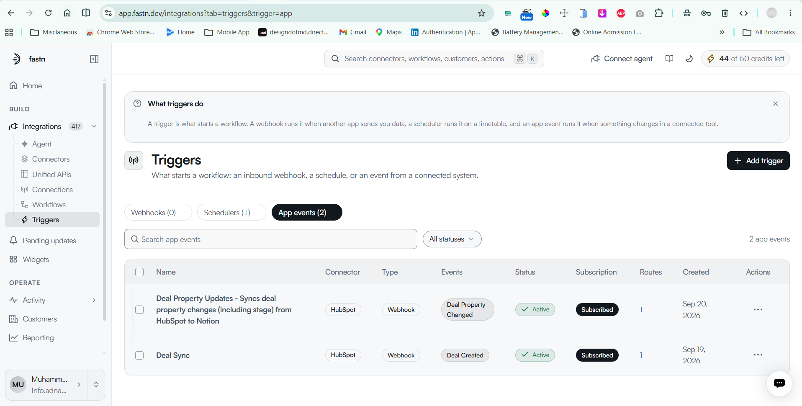
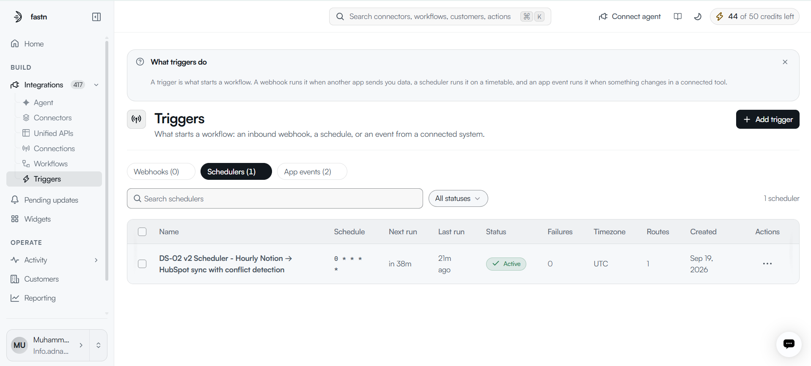

# DealSync Sentinel 🚀

**Never lose a deal update again. Intelligent sync between HubSpot & Notion with conflict resolution.**

[](https://fastn.com)
[](https://nextjs.org)
[](https://www.typescriptlang.org/)

---

## 🎯 What It Does

DealSync Sentinel automatically keeps your HubSpot deals and Notion databases in perfect sync. When conflicts arise, you get a beautiful UI to resolve them with one click.

**No more:**
- ❌ Manual double-entry between systems
- ❌ Lost updates when both systems change
- ❌ Data drift and inconsistencies
- ❌ Confusion about which data is correct

**Instead you get:**
- ✅ **Real-time sync** - Changes appear instantly
- ✅ **Two-way flow** - Updates work in both directions
- ✅ **Smart conflict detection** - Never lose data
- ✅ **Visual resolution** - Fix conflicts with one click
- ✅ **Zero duplicates** - Intelligent deduplication
- ✅ **Complete history** - Full audit trail

---

## 📸 See It In Action

### Active Workflows
All your sync workflows running in the Fastn platform - DS-01, DS-02, and DS-04 are active and ready to keep your data in sync.



### Connected Systems
HubSpot, Notion, and Slack connectors configured and connected. OAuth 2.0 managed securely by Fastn.



### Webhook Triggers
Real-time triggers listening for deal creation and property changes from HubSpot. Instant synchronization with zero polling delays.



### Scheduled Sync
Automated hourly sync from Notion → HubSpot with intelligent conflict detection to prevent data loss.



---

## 🚀 Getting Started

1. **Clone the repository**
   ```bash
   git clone https://github.com/buildswithadnan/dealsync-sentinal.git
   cd dealsync-sentinal
   ```

2. **Install and run**
   - Open the project in your code editor
   - Install dependencies
   - Copy `.env.example` to `.env.local` and add your API keys
   - Start the development server
   - Visit the dashboard

3. **Read the docs**
   - 📖 [Complete Setup Guide](./docs/readme_dealsync.md)
   - 🎥 [Video Tutorial](#) *(coming soon)*

---

## 🎨 Key Features

### Automatic Synchronization
Deals sync automatically between HubSpot and Notion in both directions. Create a deal in HubSpot, it appears in Notion. Update a deal in Notion, it syncs to HubSpot.

### Intelligent Conflict Detection
When both systems are modified since the last sync, DealSync Sentinel detects the conflict instead of overwriting data. You decide which version to keep.

### Beautiful Dashboard
Monitor everything from a clean, modern dashboard built with Next.js 16 and Tailwind CSS.

### Deduplication
Never worry about duplicate records. The system intelligently checks for existing deals before creating new ones.

### Complete Audit Trail
Every sync operation is logged with before/after values, timestamps, and success status. Perfect for compliance and debugging.

---

## 🏗️ How It Works

```
HubSpot CRM ←→ Fastn Workflows ←→ Notion Database
                      ↓
              Next.js Dashboard
           (Monitor & Resolve Conflicts)
```

**Workflows:**
- **DS-01**: HubSpot → Notion (real-time via webhooks)
- **DS-02**: Notion → HubSpot (scheduled sync with conflict detection)
- **DS-03**: Handle deletions in both systems
- **DS-04**: Resolve conflicts through the UI

[Read the full technical documentation](./docs/readme_dealsync.md)

---

## 🎯 Use Cases

### For Sales Teams
Keep your CRM and workspace in sync without manual work. Focus on selling, not data entry.

### For Operations
Maintain data integrity across systems with full audit trails and conflict resolution.

### For Managers
Monitor sync health and quickly resolve data conflicts with visual tools.

---

## 📚 Documentation

- 📖 **[Complete Documentation](./docs/readme_dealsync.md)** - Everything you need to know
- 🔧 **[Setup Guide](./docs/readme_dealsync.md#setup-instructions)** - Step-by-step setup
- 🏗️ **[Architecture](./docs/readme_dealsync.md#how-it-works)** - How it works under the hood
- 🐛 **[Troubleshooting](./docs/readme_dealsync.md#troubleshooting)** - Common issues and solutions
- 🔌 **[API Reference](./docs/readme_dealsync.md#api-reference)** - API endpoints and usage

---

## 🛠️ Built With

- **[Fastn Platform](https://fastn.com)** - Workflow orchestration and connectors
- **[Next.js 16](https://nextjs.org)** - React framework with App Router
- **[TypeScript](https://www.typescriptlang.org/)** - Type-safe development
- **[Tailwind CSS](https://tailwindcss.com)** - Modern styling
- **[Lucide Icons](https://lucide.dev)** - Beautiful icons

---

## 🤝 Contributing

Contributions are welcome! Feel free to:
- 🐛 Report bugs
- 💡 Suggest features
- 📝 Improve documentation
- 🔧 Submit pull requests

---

## 📄 License

MIT License - See [LICENSE](./LICENSE) for details

---

## 🙋‍♂️ Support

- 📖 [Documentation](./docs/readme_dealsync.md)
- 🐛 [Report Issues](https://github.com/buildswithadnan/dealsync-sentinal/issues)
- 💬 [Discussions](https://github.com/buildswithadnan/dealsync-sentinal/discussions)

---

**Built with ❤️ by Muhammad Adnan**

*DealSync Sentinel - Because your data deserves to stay in sync.*
